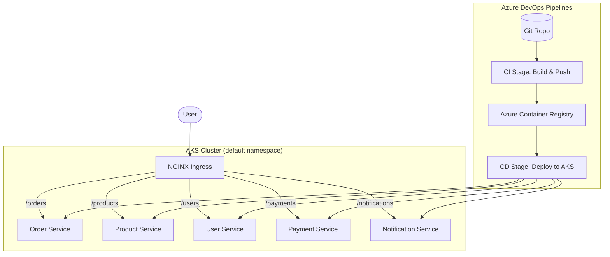

# Azure AKS Microservices Portfolio

A professional-grade showcase of modern DevOps practices using **Azure Kubernetes Service (AKS)**, **Azure DevOps (ADO)**, and **.NET 8 Microservices**.

## 🚀 Overview

This project demonstrates a scalable, cloud-native architecture consisting of 5 microservices deployed to AKS via automated multi-stage CI/CD pipelines.

### Key Features
- **5 .NET 8 Microservices**: Modern Minimal APIs with Docker containerization.
- **Multi-Stage CI/CD**: Modular Azure DevOps pipelines using YAML templates.
- **Kubernetes Orchestration**: Deployment, Service, and Ingress manifests for AKS.
- **Scalable Architecture**: Resource limits, replicas, and rolling updates configured.
- **Portfolio Ready**: Clean code structure and professional documentation.

## 🏗️ Architecture



## 📁 Project Structure

- `src/`: Source code for the 5 .NET microservices.
- `k8s/`: Kubernetes manifests (Deployments, Services, Ingress).
- `pipelines/`: Azure DevOps YAML pipelines and reusable templates.
- `README.md`: Project documentation.

## 🛠️ Tech Stack

- **Backend**: .NET 8 (C#)
- **Containerization**: Docker
- **Orchestration**: Azure Kubernetes Service (AKS)
- **CI/CD**: Azure DevOps Pipelines
- **Infrastructure**: Kubernetes Manifests (YAML)

## 🚦 Getting Started

### Prerequisites
- Azure Subscription
- Azure DevOps Organization
- Azure Container Registry (ACR)
- AKS Cluster

### Setup Instructions
1. **Clone the repository**:
   ```bash
   git clone https://github.com/ajitraidits9878/azure-aks-pipleines.git
   ```
2. **Configure Service Connections**:
   - Create an ACR service connection named `acr-service-connection`.
   - Create an AKS service connection named `aks-service-connection`.
3. **Import Pipeline**:
   - Point Azure DevOps to `pipelines/azure-pipelines.yml`.
4. **Run Pipeline**:
   - Watch the automated build and deployment process.

---
*Created for professional portfolio demonstration.*
